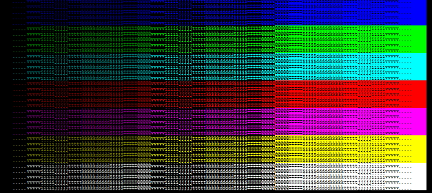

# CMD下的彩色动画（Python）

可以直接把视频转换成CMD里的字符画，其实就是调用系统的api，实现指定位置输出字符。

---

通过添加不同字符，颜色稍微多了点……

最后完成了一个连续输出的动画，每次输出两帧之间的差异部分，和直接显示图片比稍微提升了一点显示速度。

get image  --------------  利用ffmpeg获取视频截图

image to data  ----------  求余弦距离，匹配最符合的控制台颜色，保存到文件

data to diffdata  -------  逐帧比较画面差异，只保存差异，用于输出

